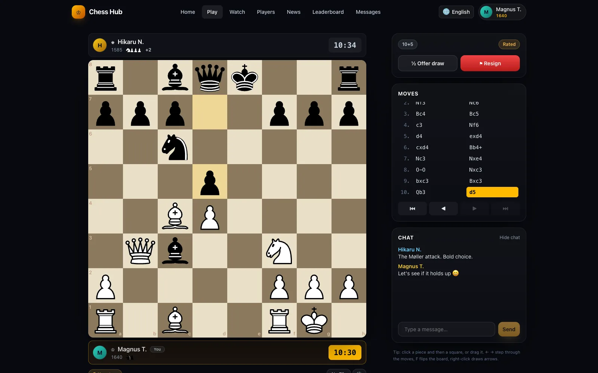
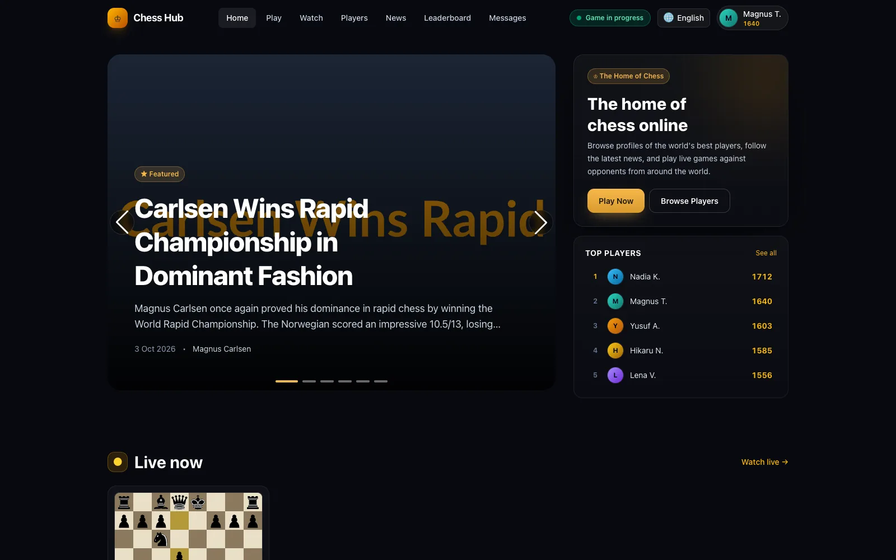
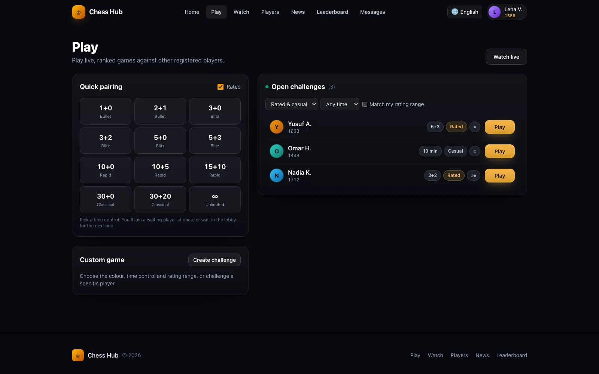
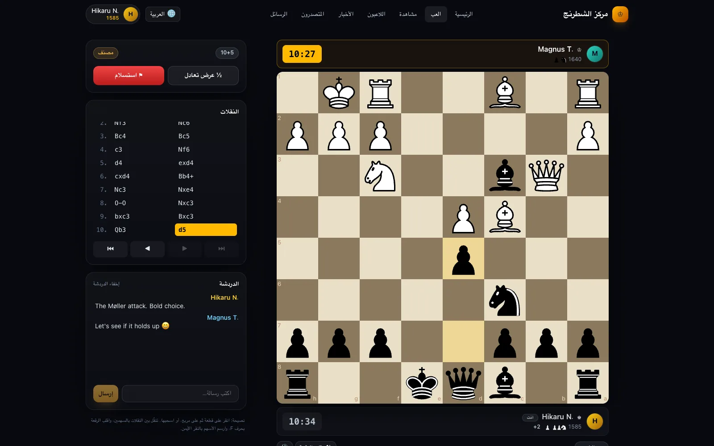
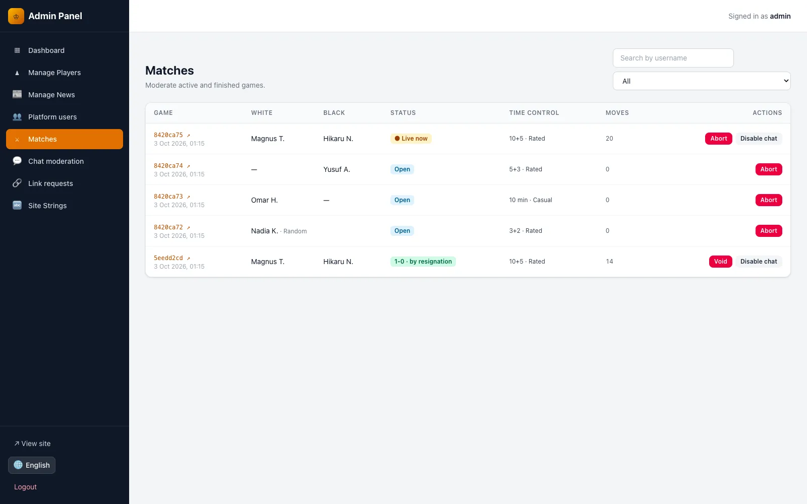

# Chess Hub

A bilingual (English / Arabic) chess players & news CMS **and** a real-time
multiplayer chess platform. Registered players challenge each other, or get
paired automatically, and play live rated games with server-validated moves and
server-authoritative clocks; admins curate the player and news catalogue and
moderate the community.

> **العربية:** [README.ar.md](README.ar.md)



| | |
| --- | --- |
|  |  |
|  |  |

---

## Contents

- [Stack](#stack)
- [Quick start](#quick-start)
- [Demo accounts](#demo-accounts)
- [Features](#features)
- [Project layout](#project-layout)
- [How it works](#how-it-works)
- [Environment variables](#environment-variables)
- [Commands](#commands)
- [API](#api)
- [Testing](#testing)
- [Security](#security)
- [Deployment](#deployment)

---

## Stack

| Layer      | Technology                                                    |
|------------|---------------------------------------------------------------|
| Runtime    | **Bun 1.3** — runs the TypeScript sources directly, no build step |
| Language   | TypeScript 5.9 in strict mode (type-checked by `tsc`, not emitted) |
| API        | Express 5                                                      |
| Real-time  | Socket.IO 4                                                    |
| Database   | MongoDB 7+ via Mongoose 9, as a replica set                    |
| Auth       | JWT bearer tokens (`jsonwebtoken`), bcrypt via `Bun.password`  |
| Validation | Zod 4 at every request boundary                                |
| Chess      | `chess.js` server-side, verified in-repo with perft            |
| Images     | `sharp` — uploads are decoded and re-encoded before storage    |
| Email      | Brevo transactional API (logged to the console in development) |
| Logging    | Pino (pretty in dev, structured JSON in production)            |
| Frontend   | React 19, Vite 8 (run under Bun), React Router 7               |
| Chess UI   | `react-chessboard` 5, click- or drag-to-move                   |
| i18n       | `react-i18next` with plural rules and admin-editable overrides |
| Styling    | Tailwind CSS 4, custom dark design system, full RTL support    |
| Tests      | `bun test` + Supertest, against a real MongoDB                 |
| Shipping   | Multi-stage Dockerfile, Compose file, GitHub Actions CI        |

---

## Quick start

**Prerequisites:** [Bun](https://bun.sh) 1.3+ and MongoDB 7+ (`mongod` and
`mongosh` on your `PATH`). On macOS:

```bash
curl -fsSL https://bun.sh/install | bash
brew tap mongodb/brew && brew install mongodb-community
```

Then one command runs everything:

```bash
git clone https://github.com/HamzaAshour949/chess.git
cd chess
bun run up
```

[`bun run up`](scripts/up.ts):

1. installs dependencies (instant when nothing changed);
2. on the first run, creates `.env` from `.env.example` with a fresh
   `JWT_SECRET`;
3. checks that ports 8080 and 3000 are free, and names what holds them if not;
4. starts the project-local MongoDB (unless `MONGODB_URI` points elsewhere);
5. seeds the database if it is empty — existing data is never touched;
6. runs the API and the site, and prints the address and demo sign-ins once
   both answer.

**Ctrl+C stops all of it**, MongoDB included (a MongoDB that was already
running is left alone). `bun run up --open` also opens the browser.

- Site (Vite dev server, hot reload): <http://localhost:3000>
- API + WebSocket: <http://localhost:8080>

<details>
<summary>The same steps by hand</summary>

```bash
bun install
cp .env.example .env    # then set JWT_SECRET:
bun -e "console.log(crypto.getRandomValues(new Uint8Array(48)).toHex())"
bun run db:start && bun run db:seed && bun run dev
```

</details>

Use **<http://localhost:3000>** while developing. Vite proxies `/api` and
`/uploads` to port 8080; the browser's Socket.IO connection goes straight to
port 8080 (see [Real-time](#real-time) for why), which is why
`CORS_ORIGINS` includes `http://localhost:3000` in the example `.env`.

To run the way production does — one process serving the built SPA, the API
and the WebSocket on a single port:

```bash
bun run build && bun run start   # http://localhost:8080
```

There is no server build: Bun executes `server/src/*.ts` as it is.

### About the database script

`bun run db:start` runs [`scripts/mongo-dev.sh`](scripts/mongo-dev.sh), which
starts `mongod` against a project-local `.mongo-data/` directory as a
**single-node replica set**. The replica set is not decoration: MongoDB only
offers multi-document transactions on one, and finishing a game has to update
two player ratings and the game record as a single unit.

`bun run db:stop` stops it and `bun run db:status` reports on it. With Docker
instead:

```bash
docker run -d --name chess-mongo -p 27017:27017 mongo:8 --replSet rs0
docker exec chess-mongo mongosh --quiet --eval "rs.initiate()"
```

---

## Demo accounts

Created by `bun run up` on an empty database (or by `bun run db:seed`), and
printed each time the app starts.

| Role   | Username | Password          | Where                                  |
|--------|----------|-------------------|----------------------------------------|
| Admin  | `admin`  | `Admin!2026Chess` | <http://localhost:3000/admin/login>    |
| Player | `magnus` | `ChessHub!2026`   | <http://localhost:3000/login>          |
| Player | `hikaru` | `ChessHub!2026`   | <http://localhost:3000/login>          |

Both demo players are pre-verified, so they sign in without an email round-trip.

> **These credentials are in this repository.** Change them before the app is
> reachable by anyone else.

To play yourself, sign in as `magnus` in a normal window and as `hikaru` in a
private window (the two would otherwise share `localStorage`). Press **Quick
pairing** with the same time control in both, and the game opens on both
boards.

---

## Features

**Playing**

- Quick pairing by time control, open seeks in a filterable lobby, and direct
  challenges to a named player (accept or decline, with a live notification).
- Click-to-move or drag, legal-move dots, a promotion picker, move sounds, and
  optimistic moves that roll back if the server refuses them.
- Server clocks with Fischer increment. Each side's first move is untimed but
  must come within 45 seconds, or the game is aborted without rating changes.
- Resign, abort (before the second move), draw offers — offering while your
  opponent's offer is standing is an agreement — and a flag claim.
- Rematch with colours swapped, PGN download and copy, move-history browsing
  with the arrow keys, board flip.
- Threefold repetition, the fifty-move rule, stalemate, insufficient material
  and timeout-versus-insufficient-material are all scored automatically.

**Community**

- Public player profiles (`/u/:username`) with rating history, record, recent
  games and online status; a player search.
- In-game chat and direct messages with read receipts, unread badges,
  blocking, and per-player notification settings.
- A leaderboard, a "watch live" page and a recent-games feed.
- Linking an account to an editorial player profile, reviewed by an admin.

**Account**

- Email verification by one-time code, password reset by email, change of
  password, "sign out everywhere", avatar upload, interface language, and
  account deletion (the account is anonymised so finished games stay intact).

**Admin**

- Dashboard, players and news CRUD with image upload, a featured article,
  player of the month and tournament winner, and an editor for every UI string
  in both languages.
- Game moderation (abort, void with Elo reversal, chat toggle), chat and DM
  moderation, link-request review, and user moderation (ban, mute, verify,
  unlink).

**Everywhere**

- Full Arabic RTL with correct bidirectional isolation of names and moves, and
  Arabic plural forms; the language is set before first paint.
- Live updates over Socket.IO with REST polling as a fallback, toasts, confirm
  dialogs, and an error boundary per page.
- Reduced-motion support, visible keyboard focus, and a mobile layout for every
  page.

---

## Project layout

```
.
├── server/                     Express + TypeScript API and WebSocket server
│   ├── src/
│   │   ├── index.ts            Entry: HTTP + Socket.IO, sweeper, graceful shutdown
│   │   ├── app.ts              Express app: helmet, CORS, compression, static SPA
│   │   ├── config/env.ts       Zod-validated environment, fails fast at boot
│   │   ├── db/
│   │   │   ├── mongoose.ts     Connection and transaction capability probe
│   │   │   ├── seed.ts         Catalogue + demo accounts (idempotent)
│   │   │   ├── sync-indexes.ts Explicit index creation
│   │   │   └── repair-games.ts Rebuild derived game caches from move lists
│   │   ├── lib/                chess, clock, elo, otp, password, email, images,
│   │   │                       jwt, sanitize, serializers, validate
│   │   ├── middleware/         auth guards, rate limits, error handler
│   │   ├── models/             Ten Mongoose models
│   │   ├── realtime/           Socket.IO server, presence, and the publish seam
│   │   ├── routes/             One module per API area
│   │   └── services/           game-service (clocks, results, ratings, sweeper),
│   │                           account-service, blocks
│   ├── tests/                  Unit + feature suites (bun test)
│   └── bunfig.toml             Test preload that pins the test environment
│
├── frontend/                   React 19 SPA
│   ├── public/                 favicon, manifest, robots.txt, boot.js
│   └── src/
│       ├── api.js              Axios client; picks the right identity's token
│       ├── realtime.js         Shared Socket.IO connection
│       ├── hooks/              useLive (game, chat, lobby, clocks), useFetch, …
│       ├── lib/                format, chess-view, sound
│       ├── components/         Board, chat, avatars, search, toasts, dialogs
│       ├── context/            Admin auth, player auth, language
│       ├── layouts/            Public and admin shells
│       ├── locales/            en.json / ar.json
│       └── pages/              public/ and admin/ screens, all lazy-loaded
│
├── Dockerfile                  Bun image: SPA build + server runtime
├── docker-compose.yml          App + MongoDB replica set
├── .github/workflows/ci.yml    Typecheck, lint, test, build, Docker build
├── scripts/up.ts               `bun run up`: the one-command dev start
├── scripts/mongo-dev.sh        Local MongoDB replica set helper
└── uploads/                    Uploaded images (git-ignored)
```

---

## How it works

### Two identities, deliberately separate

`admins` and `users` are different collections. An admin is not a player with a
flag set, and no route promotes one to the other.

| Identity | Login endpoint               | Token role | `localStorage` key | Guard          |
|----------|------------------------------|------------|--------------------|----------------|
| Admin    | `POST /api/auth/login`       | `admin`    | `token`            | `requireAdmin` |
| Player   | `POST /api/users/auth/login` | `user`     | `user_token`       | `requireUser`  |

The role is a **signed claim and the token's audience**, so a token minted for
one side is rejected outright as the other. Both guards re-read the account on
every request rather than trusting the token, so a ban, mute or deletion takes
effect immediately instead of whenever the token happens to expire.

A player token also carries the account's `tokenVersion`. Changing the
password, resetting it, "sign out everywhere" and deleting the account all bump
it, which revokes every token issued before.

### The move list is the source of truth

A game stores `moves` — a space-separated UCI list. `fen`, `pgn` and `moveCount`
are **caches derived from it** and rewritten on every move. Every move request
replays the list from the starting position and validates against the result.

Two things fall out of this:

1. **Threefold repetition is detectable.** A FEN carries no history, so an
   engine loaded from one cannot see a repetition. A replayed game can.
2. **A tampered or stale cache cannot make an illegal position stand.** There is
   a test that rewrites a game's stored FEN to a winning position; the next move
   simply overwrites it from the move list.

`bun run db:repair` rebuilds the caches for every game if they ever drift.

### Concurrency

Every state transition is a **guarded conditional update**, so two racing
requests cannot both win:

- a move updates only if `version` is unchanged since it was read;
- accepting a challenge updates only while the game is still `open`;
- finishing updates only while `active`, and the rating write is additionally
  guarded on `ratingsApplied`, so a retry cannot double-count a result;
- voiding updates only while `voidedAt` is unset, so Elo is reversed once.

Partial unique indexes back this up: a player can have one open seek at a time,
and one open challenge per opponent. Each of these has a test that fires the
requests simultaneously.

### Clocks

Time budgets are stored in **milliseconds** and are server-authoritative. On
each move the server subtracts the elapsed time and adds the Fischer increment;
milliseconds avoid the rounding drift a whole-second budget accumulates in the
mover's favour across a long game.

- **The first move of each side is free.** The clock starts on Black's reply,
  as on every major server. Each side has `FIRST_MOVE_TIMEOUT_SECONDS` (45) to
  make that move, or the game is aborted, unrated, as `abandoned`.
- Every live game stores the `deadlineAt` at which its current state expires.
  A **sweeper** runs every 3 seconds, settles overdue games and tells both
  players, so a flag falls even when nobody has the board open. It also
  withdraws seeks nobody accepted within `CHALLENGE_TTL_MINUTES` (30).
- The same check also runs lazily on every read and move attempt.
- Running out of time against an opponent who cannot possibly mate (a bare
  king, or king and one minor piece) is scored a **draw**, per FIDE.

Responses carry `server_time`, letting clients correct for their own clock skew
rather than assuming the two machines agree.

### Real-time

Socket.IO rooms: one per game (`game:<id>`), one for the lobby, and one per
player for direct messages, challenges and account notices. Clients subscribe
to the boards they are watching, so an idle game costs nothing. The server
tracks which players are connected, which is where the "online" dots come from.

The REST API stays complete and authoritative. Every live view also polls — at
30 seconds while the socket is connected, at 2 seconds while it is not — so a
client behind a proxy that blocks WebSockets still works. Updates carry a
`version`, and a client ignores any that is not newer than what it shows.

In development the SPA connects its socket **directly** to the API origin
instead of through the Vite proxy: Vite's WebSocket proxy relies on a Node
socket method Bun does not implement. Production is unaffected — there the SPA
and the socket share one origin.

### Elo

Separate from the editorial `Player.rating`. New accounts start at 1200.
K-factor is 40 while provisional (fewer than 10 games), 20 once established, and
10 at 2400+. Every finished game stores both players' before and after ratings,
and voiding a game reverses the exact deltas it applied. Aborted games are never
rated.

### Player-profile linking (security-critical)

A player may request to be associated with an editorial `Player` profile. The
link is one-way and confers **identity only**:

- only an admin approving a `LinkRequest` ever sets `User.linkedPlayerId`;
- there is no endpoint through which a player can set it;
- being linked grants **no write access** to the profile — there is a test that
  signs in as a linked player, tries to edit that profile, and is refused;
- a unique partial index guarantees one profile can never back two accounts;
- approving one request automatically rejects other pending requests for the
  same profile, and the player is told the outcome live and by email.

### Bilingual content

Content rows carry `_en` and `_ar` fields. `?lang=en|ar` selects which one fills
the `name` / `title` / `content` field, while both variants stay present for the
admin forms. News additionally has a `region` of `en`, `ar` or `both`, choosing
which language edition it appears in.

The SPA ships static `en.json` / `ar.json` bundles and layers admin-editable
overrides from `GET /api/strings` on top. Both files have the same base keys;
Arabic additionally carries the `_zero`, `_two`, `_few` and `_many` plural forms
English has no use for. A signed-in player's language is stored on the account
and follows them between devices; Arabic switches the document to RTL before
the first paint.

---

## Environment variables

Copy `.env.example` to `.env`. Bun loads it (the scripts pass
`--env-file=../.env`); a variable set in the real environment wins over the
file. Everything is validated at boot — a missing or malformed value stops the
process with a message naming the field.

| Variable | Purpose | Default |
|---|---|---|
| `NODE_ENV` | `development` \| `test` \| `production` | `development` |
| `PORT` | HTTP + WebSocket port | `8080` |
| `APP_URL` | Where people open the site; links in emails and the seed summary use it (`http://localhost:3000` in the example `.env`, for the dev server) | `http://localhost:8080` |
| `MONGODB_URI` | Connection string | — |
| `DB_SYNC_INDEXES` | Create indexes on boot; `0` if a release step runs `db:indexes` | `1` |
| `JWT_SECRET` | Token signing key — **required**, min 32 chars; the example value is refused in production | — |
| `JWT_EXPIRES_IN` | Token lifetime | `7d` |
| `BCRYPT_ROUNDS` | Password hashing cost (10–15) | `12` |
| `CORS_ORIGINS` | Comma-separated allow-list; empty means same-origin only | *(empty)* |
| `RATE_LIMIT_WINDOW_MS` | Global limiter window | `60000` |
| `RATE_LIMIT_MAX` | Global requests per window per IP | `300` |
| `TRUST_PROXY` | `1` only behind a reverse proxy — see [Security](#security) | `0` |
| `UPLOAD_DIR` | Where images are written | `uploads` |
| `UPLOAD_MAX_BYTES` | Maximum upload size | `5242880` |
| `DEFAULT_RATING` | Starting Elo | `1200` |
| `PROVISIONAL_GAMES` | Games below which the provisional K-factor applies | `10` |
| `FIRST_MOVE_TIMEOUT_SECONDS` | Time each side has for its first move | `45` |
| `CHALLENGE_TTL_MINUTES` | Unaccepted seeks are withdrawn after this | `30` |
| `BREVO_API_KEY` | Transactional email key — **required in production** unless `EMAIL_CONSOLE=1` | *(empty)* |
| `BREVO_FROM_EMAIL` / `BREVO_FROM_NAME` | Sender identity | `no-reply@chesshub.local` / `Chess Hub` |
| `EMAIL_CONSOLE` | Log emails (codes included) instead of sending them | `0` |
| `LOG_LEVEL` | Pino level | `info` |

---

## Commands

Run from the repository root.

| Command | What it does |
|---|---|
| `bun run up` | **Everything for development:** install, `.env`, MongoDB, seed if empty, API + site; Ctrl+C stops it all |
| `bun run setup` | Install, start MongoDB and seed, without running the app |
| `bun run dev` | API (watch mode) and Vite dev server together |
| `bun run dev:api` / `bun run dev:web` | Just one of them |
| `bun run build` | Build the SPA into `frontend/dist` |
| `bun run start` | Run the server, serving the built SPA |
| `bun run test` | Full test suite (`bun test`) |
| `bun run typecheck` | `tsc` over the server and its tests |
| `bun run lint` | ESLint over both workspaces |
| `bun run check` | Typecheck, lint and test |
| `bun run format` | Prettier |
| `bun run db:start` / `db:stop` / `db:status` | Local MongoDB replica set |
| `bun run db:seed` | Seed the catalogue and demo accounts (idempotent) |
| `bun run --cwd server db:seed --fresh` | Wipe first, then seed |
| `bun run --cwd server db:seed --if-empty` | Seed only a database with no data yet |
| `bun run db:indexes` | Create/update every declared index |
| `bun run db:repair` | Rebuild derived game caches from move lists |

---

## API

90 routes. All are under `/api`, return JSON, and report failures as
`{ "error": "message" }` — with a `details` array for validation errors and a
`code` for cases the SPA branches on (`email_unverified`, `account_banned`).

Lists accept `?page=` and `?per_page=`; bilingual reads accept `?lang=en|ar`.

### Public

```
GET    /api/health                  503 while the database is unreachable
GET    /api/players                 ?lang &page &per_page &search
GET    /api/players/:id             ?lang
GET    /api/players/homepage        ?lang
GET    /api/news                    ?lang &page &per_page &player_id
GET    /api/news/:id                ?lang
GET    /api/strings                 ?lang
GET    /api/games/lobby             ?rated &color &min_tc &max_tc &viewer_rating
GET    /api/games/live              ?min_rating &max_rating
GET    /api/games/recent
GET    /api/games/leaderboard       ?limit
GET    /api/games/:id
GET    /api/games/:id/pgn           PGN file with the seven-tag roster
GET    /api/games/:id/chat
GET    /api/users                   ?search            (60/min)
GET    /api/users/:username         profile, online status, relationship
GET    /api/users/:username/games   ?page &per_page
GET    /api/users/:username/rating-history
POST   /api/auth/login              (10 per 15 min)
POST   /api/auth/setup              (only while no admin exists)
POST   /api/users/auth/register     (10/hr)
POST   /api/users/auth/verify-otp   (15 per 15 min)
POST   /api/users/auth/resend-otp   (6/hr)
POST   /api/users/auth/login        (10 per 15 min)
POST   /api/users/auth/forgot-password  (6/hr)
POST   /api/users/auth/reset-password   (15 per 15 min)
```

### Player token required

```
GET    /api/users/auth/me
PATCH  /api/users/auth/me           display_name, country, lang, notif_*,
                                    avatar_url (null only, to remove it)
POST   /api/users/auth/me/avatar    (20/hr, re-encoded to a square)
POST   /api/users/auth/me/password  current_password, new_password
POST   /api/users/auth/me/sessions/revoke
DELETE /api/users/auth/me           password; anonymises the account
POST   /api/games                   color, rated, time_control_seconds,
                                    increment_seconds, min/max_opp_rating,
                                    opponent_id (a direct challenge)
POST   /api/games/quick             pair with a matching seek, or post one
POST   /api/games/:id/accept | cancel | decline
POST   /api/games/:id/move          (180/min)
POST   /api/games/:id/resign | abort | claim-time
POST   /api/games/:id/draw-offer | draw-accept | draw-decline
POST   /api/games/:id/rematch
POST   /api/games/:id/chat          (20/min, ≤500 chars, URLs stripped)
GET    /api/games/me/games          ?status=active|finished|all &page
GET    /api/games/me/challenges     incoming and outgoing
GET    /api/messages/threads
GET    /api/messages/unread-count
GET    /api/messages/with/:userId
POST   /api/messages/with/:userId   (30/min, ≤2000 chars, links kept)
POST   /api/messages/with/:userId/read
GET    /api/messages/blocks
POST   /api/messages/blocks/:userId
DELETE /api/messages/blocks/:userId
POST   /api/links/request           (5/hr)
GET    /api/links/my-requests
```

### Admin token required

```
GET    /api/auth/me
POST   /api/players                 PUT/DELETE /api/players/:id
GET    /api/news/admin              POST /api/news, PUT/DELETE /api/news/:id
GET    /api/strings/all             POST /api/strings
PUT    /api/strings/bulk            DELETE /api/strings/:key
POST   /api/upload/image            (30/min, ≤5 MB, re-encoded)
GET    /api/games/admin/stats
GET    /api/games/admin/games       ?status &search &page
POST   /api/games/admin/games/:id/abort | void | chat-toggle
GET    /api/games/admin/messages    DELETE /api/games/admin/messages/:id
GET    /api/messages/admin/dms      DELETE /api/messages/admin/dms/:id
GET    /api/links/admin/requests
POST   /api/links/admin/requests/:id/approve | reject
GET    /api/links/admin/users       ?status &search &page
POST   /api/links/admin/users/:id/ban | unban | verify | mute | unmute | unlink
```

### WebSocket

Connect to the same origin, path `/socket.io`, with the player token in
`auth.token`. Anonymous connections are allowed — spectating is public.

| Direction | Event | Payload |
|---|---|---|
| → | `game:watch` / `game:unwatch` | game id |
| → | `lobby:watch` / `lobby:unwatch` | — |
| ← | `game:update` | full game, plus `last_move` after a move |
| ← | `game:chat` | one message |
| ← | `lobby:update` | a seek that was created, cancelled, accepted or expired |
| ← | `dm:new` | one direct message |
| ← | `challenge:received` / `challenge:closed` | a direct challenge, or its end |
| ← | `game:started` | your seek or challenge was accepted |
| ← | `link:reviewed`, `account:banned`, `account:deleted` | account notices |

---

## Testing

```bash
bun run test
```

218 tests in 12 files (about 35 seconds), run by `bun test` against a real MongoDB
(`chess_hub_test` — the helpers refuse any database whose name does not end in
`_test`). `server/bunfig.toml` preloads `tests/setup.ts`, which pins the test
environment before any module reads it.

Move generation is verified with **perft** against the six reference positions
from the Chess Programming Wiki. A single missing or spurious move anywhere in
those trees changes the node counts, so this proves the legality rules the whole
security model rests on, rather than taking them on trust from the dependency.

The suite also covers the things that are easy to get wrong and hard to notice:
simultaneous moves, simultaneous accepts, racing quick-pairings, double
resignation, flag falls and the first-move timeout, the sweeper, threefold
repetition, rating reversal on void, token revocation, OTP attempt races, and
the boundaries between admin, player and anonymous access.

---

## Security

1. **Two separate identities.** Role is a signed claim *and* the token audience;
   accounts are re-read on every request so moderation is immediate. Tokens are
   revoked by bumping the account's `tokenVersion`.
2. **Passwords** hashed with bcrypt (cost 12) via `Bun.password`; hashes with a
   lower cost are upgraded on the next login. Failed logins still run a
   comparison against a dummy hash, so a missing account does not return
   measurably faster and become a username oracle.
3. **One-time codes stored hashed**, never in plaintext, with attempt limits,
   expiry and a resend cooldown. Each attempt is reserved atomically before the
   code is checked, so parallel guesses cannot exceed the limit. Verification,
   resend and password reset answer the same whether or not the address exists.
4. **Every input validated with Zod** at the boundary; user text is escaped
   before it becomes a regex, so a crafted `?search=` cannot inject a pattern.
5. **Uploads decoded and re-encoded with sharp.** Extensions are never trusted,
   filenames are UUIDs, EXIF is stripped, and oversized images are downscaled.
   There is a test that uploads a PHP web shell renamed to `.png`.
6. **Rate limits** on every endpoint that accepts input, tightest on credentials;
   signed-in limits are per account, not per IP.
7. **CSP and security headers** via helmet; HSTS in production. Internal error
   messages never reach the client.
8. **CORS is an allow-list** defaulting to same-origin only. A wildcard is never
   accepted.
9. **`TRUST_PROXY` is opt-in.** Trusting `X-Forwarded-For` blindly lets any
   client spoof its IP and walk past every rate limit — enable it only when a
   reverse proxy in front of the app actually sets that header.
10. **Chat links stripped** in-game to blunt off-platform scams, and blocking
    hides the conversation and stops challenges in both directions.
11. **Usernames are unique case-insensitively**, and names like `admin` or
    `support` are reserved, so nobody can impersonate staff or another player.
12. **Production refuses to boot** with the example `JWT_SECRET` or without a
    way to send email.
13. **Secrets are never committed.** `.env` is git-ignored; `.env.example`
    documents the shape.

### Before going live

- Set a fresh `JWT_SECRET`, and change the seeded passwords (or don't seed).
- Set `NODE_ENV=production` and `APP_URL` to your public `https://` origin.
- Leave `CORS_ORIGINS` empty when the app serves the SPA itself.
- Set `TRUST_PROXY=1` **only** behind a proxy you control.
- Enable MongoDB authentication and point `MONGODB_URI` at a credentialed user.
- Set `BREVO_API_KEY` so verification and reset emails actually send.
- Serve over HTTPS.

---

## Deployment

### Docker

```bash
cp .env.example .env              # set JWT_SECRET, PRODUCTION_APP_URL, BREVO_API_KEY
docker compose up -d --build      # app on :8080, MongoDB as a replica set
docker compose exec app bun server/src/db/seed.ts   # optional demo data
```

Compose reads `PRODUCTION_APP_URL` and `PRODUCTION_CORS_ORIGINS` rather than
`APP_URL` and `CORS_ORIGINS`, so the development values in `.env` never reach
the container.

The image is built in three stages: the SPA is built with Vite; the server's
production dependencies are installed on their own (no React, Vite or
TypeScript); and the runtime stage copies those two plus `server/src` into a
slim Bun image running as a non-root user, with a health check on
`/api/health`. Uploaded images live on a volume.

### Without Docker

```bash
bun install --frozen-lockfile
bun run build          # SPA to frontend/dist
bun run start          # indexes are synced on boot
```

One process serves the API, the WebSocket and the built SPA on `PORT`. Hashed
assets are served as immutable, `index.html` as `no-cache`, and everything is
gzip-compressed. Behind a reverse proxy, forward the WebSocket upgrade for
`/socket.io` and set `TRUST_PROXY=1`.

`GET /api/health` reports the database connection and answers 503 while it is
down, so an orchestrator can route around an unhealthy instance. `SIGTERM` and
`SIGINT` shut down cleanly: new connections stop, sockets get five seconds to
drain, then the database closes, with a 10-second hard timeout.

### CI

`.github/workflows/ci.yml` runs on every push and pull request: install with the
locked Bun version, typecheck, lint, test against a MongoDB 8 replica set, build
the SPA, and build the Docker image.

### Scaling past one instance

The game sweeper is safe to run on several instances, because every write it
makes is guarded. Two other things are in-process today: the rate limiter
(move it to a shared store) and Socket.IO fan-out and presence (add the Redis
adapter), so a push from one instance reaches clients connected to another.

### Notes on Bun

- `bson` is pinned to 7.2.0 through `overrides`. Version 7.3 calls
  `v8.startupSnapshot.isBuildingSnapshot()`, which Bun does not implement, and
  Mongoose fails to load.
- `sharp` is listed in `trustedDependencies` so its install script can fetch the
  native binary.

---

## License

MIT.
